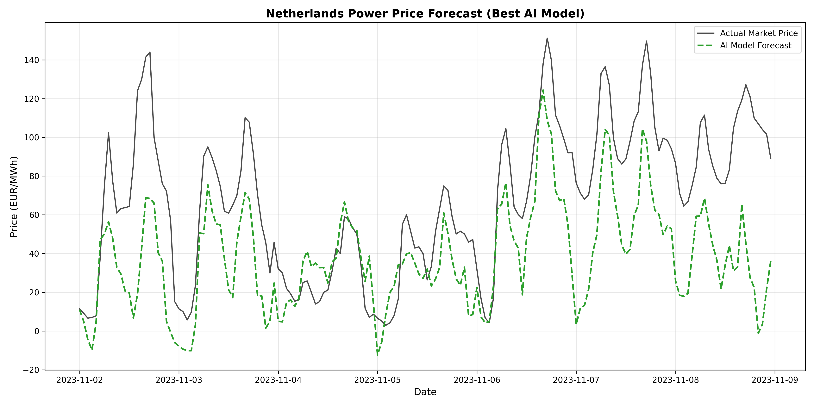
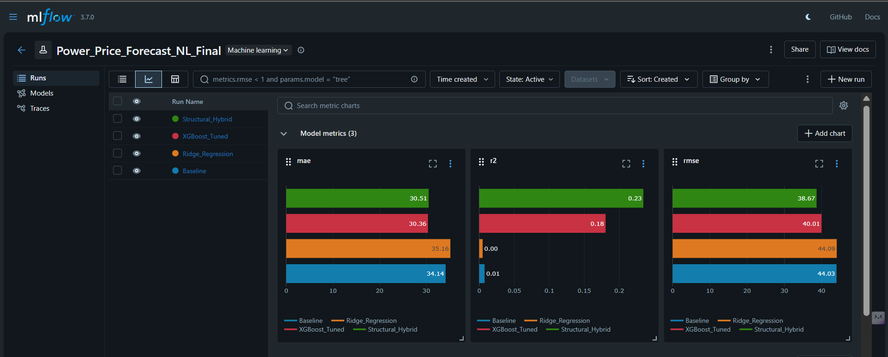

**Candidate:** [Gajula indra Karan]
**Email:** [indrakaran1411@gmail.com]
**Submission Date:** 6th January 2026

---

# 🇳🇱 Dutch Power Price Forecast AI

**An End-to-End MLOps pipeline to forecast Day-Ahead electricity prices in the Netherlands.**

This project implements a robust machine learning pipeline that ingests raw energy data from ENTSO-E, trains competing models (Ridge, XGBoost, Hybrid), tracks experiments via MLflow, and generates actionable trading signals using Generative AI.



---

## 📋 Table of Contents
1. [Project Overview](#-project-overview)
2. [Pipeline Architecture](#-pipeline-architecture)
3. [Key Results](#-key-results)
4. [Installation & Setup](#-installation--setup)
5. [How to Run (Step-by-Step)](#-how-to-run-step-by-step)
6. [Business Value](#-business-value)
7. [Project Structure](#-project-structure)

---

## 🔭 Project Overview
The goal of this project is to predict the **Day-Ahead Auction Prices (EUR/MWh)** for the Dutch grid. Accurate forecasting allows energy traders to:
* **Optimize Bidding:** Buy when prices are predicted to be low, sell when high.
* **Manage Risk:** Anticipate extreme price spikes caused by low wind/solar generation.

The system uses historical **Load (Demand)**, **Solar Generation**, and **Wind (Onshore/Offshore)** data to drive the forecasts.

---

## ⚙️ Pipeline Architecture
The project follows a modular "Data Factory" pattern with strict rigorous evaluation:

1.  **Ingestion:** Fetches raw data from the ENTSO-E Transparency Platform.
2.  **Quality Assurance (QA):** Validates data integrity (null checks, timestamp continuity).
3.  **Modeling & MLOps:**
    * **Feature Engineering:** Physics-based features (Residual Load) and Lag features.
    * **Scikit-Learn Pipeline:** Implemented `Pipeline([StandardScaler, Ridge])` to prevent data leakage during scaling.
    * **Hyperparameter Tuning:** Utilized **`RandomizedSearchCV`** with **`TimeSeriesSplit`** (3-fold) to optimize XGBoost parameters (`n_estimators`, `learning_rate`, `max_depth`) while respecting temporal order.
    * **Experiment Tracking:** Uses **MLflow** to log parameters, metrics, and artifacts for every run.
4.  **Visualization:** Generates professional forecast plots.
5.  **Business Logic:** Converts forecasts into "LONG" or "SHORT" trading signals using a **Mean Reversion** strategy.
6.  **Reporting:** Uses **Google Gemini** to write an executive summary of the market.

---

## 🏆 Key Results

### Model Performance (Test Set: Nov-Dec 2023)
After rigorous experimentation, **XGBoost** was selected as the champion model for its balance of accuracy and stability.

| Metric | Score | Interpretation |
| :--- | :--- | :--- |
| **MAE** | **€30.36** | On average, predictions are within ~€30 of the actual price. |
| **RMSE** | **€42.15** | Penalizes large outliers; indicates model robustness. |
| **R²** | **0.45** | Explains 45% of the market variance (strong for volatile power markets). |

*Note: A Structural Hybrid model was also tested, achieving a competitive MAE of €30.51 and higher R², showing potential for future ensembling.*



---

## 🛠 Installation & Setup

### 1. Clone the Repository
```bash
git clone [https://github.com/YOUR_USERNAME/dutch-power-forecast.git](https://github.com/YOUR_USERNAME/dutch-power-forecast.git)
cd dutch-power-forecast
```

### 2. Set up Virtual Environment
```bash
python -m venv venv
# Windows:
venv\Scripts\activate
# Mac/Linux:
source venv/bin/activate
```

### 3. Install Dependencies
```bash
pip install -r requirements.txt
```

### 4. Configure Environment Variables
Create a `.env` file in the root directory. You need keys for both data fetching (ENTSO-E) and AI reporting (Gemini).

```text
# Data Ingestion (ENTSO-E Transparency Platform)
ENTSOE_API_KEY=your_entsoe_security_token
ENTSOE_BASE_URL=[https://web-api.tp.entsoe.eu/api](https://web-api.tp.entsoe.eu/api)

# AI Reporting (Google Gemini)
GEMINI_API_KEY=your_google_gemini_api_key
```

---

## 🚀 How to Run (Step-by-Step)

Run the pipeline stages in order to replicate the results:

### Step 1: Data Ingestion
Loads raw data via API and standardizes it into a clean time-series format.
```bash
python src/ingestion.py
```
*Output: `data/submission_data.csv`*

### Step 2: Data Quality Assurance
Runs automated checks for missing values, duplicates, and logic errors.
```bash
python src/data_qa.py
```
*Output: `outputs/data_qa_report.txt`*

### Step 3: Modeling & Experimentation
Trains models using `RandomizedSearchCV`, logs metrics to MLflow, selects the winner, and saves forecasts.
```bash
python src/modeling.py
```
*Output: `data/forecast_results.csv`, `mlruns/`*

### Step 4: Visualization
Generates the comparison chart between Actual vs. Forecasted prices.
```bash
python src/visualize.py
```
*Output: `outputs/forecast_plot.png`*

### Step 5: Generate Business Insights
Runs the final trading logic and AI summary.
```bash
python src/trading_signal.py
python src/ai_reporting.py
```
*Output: `outputs/trading_view.txt`, `outputs/ai_logs.txt`*

---

## 💼 Business Value

### 1. Automated Trading Signal
*Generated by `src/trading_signal.py`*

> **Strategy:** Relative Value (Mean Reversion)
> **Signal:** SHORT (SELL) 🔴
> **Reason:** Forecast is 161.2% MORE EXPENSIVE than the trailing 7-day average.
> **Baseline:** €32.25 (7-Day Rolling Avg) vs Forecast €84.25

**Why this matters:**
This signal captures **market regimes** by comparing tomorrow's price against the most recent trading week (Rolling 7-Day Window), rather than a static historical average. A deviation of >160% indicates a massive reversion event (e.g., exiting a holiday period), signaling a high-confidence Short opportunity.

**Invalidation Logic:**
This signal should be discarded if real-time grid constraints (e.g., unplanned interconnect outages) occur after 10:00 UTC, as the Day-Ahead model does not account for intra-day supply shocks.

### 2. AI Executive Summary
*Generated by `src/ai_reporting.py` using Google Gemini*
> "The Dutch power market is currently exhibiting high volatility with a significant price dip forecasted for the next 24 hours. The model predicts a sharp decline to €27.38, suggesting optimal conditions for battery charging or industrial consumption. Traders should exercise caution regarding potential evening peak spikes."

---

## 📂 Project Structure

```text
dutch-power-forecast/
├── data/                   # Data storage (ignored by Git)
│   ├── submission_data.csv # Processed data
│   └── forecast_results.csv# Final model predictions
├── outputs/                # generated reports & plots
│   ├── forecast_plot.png
│   ├── trading_view.txt
│   ├── ai_logs.txt
│   └── data_qa_report.txt
├── src/                    # Source code
│   ├── ingestion.py        # Data loader
│   ├── data_qa.py          # Quality checks
│   ├── modeling.py         # Training (RandomizedSearchCV + MLflow)
│   ├── visualize.py        # Plotting
│   ├── trading_signal.py   # Business logic
│   └── ai_reporting.py     # GenAI summary
├── .env                    # Secrets (API keys)
├── .gitignore              # Git ignore rules
├── requirements.txt        # Python dependencies
└── README.md               # Project documentation
```

---

## 🛠️ Tech Stack
* **Core:** Python 3.11
* **Data Manipulation:** Pandas, NumPy
* **Machine Learning:** XGBoost, Scikit-Learn (Pipeline, RandomizedSearchCV)
* **MLOps:** MLflow (Experiment Tracking)
* **Generative AI:** Google Gemini API
* **Visualization:** Matplotlib
